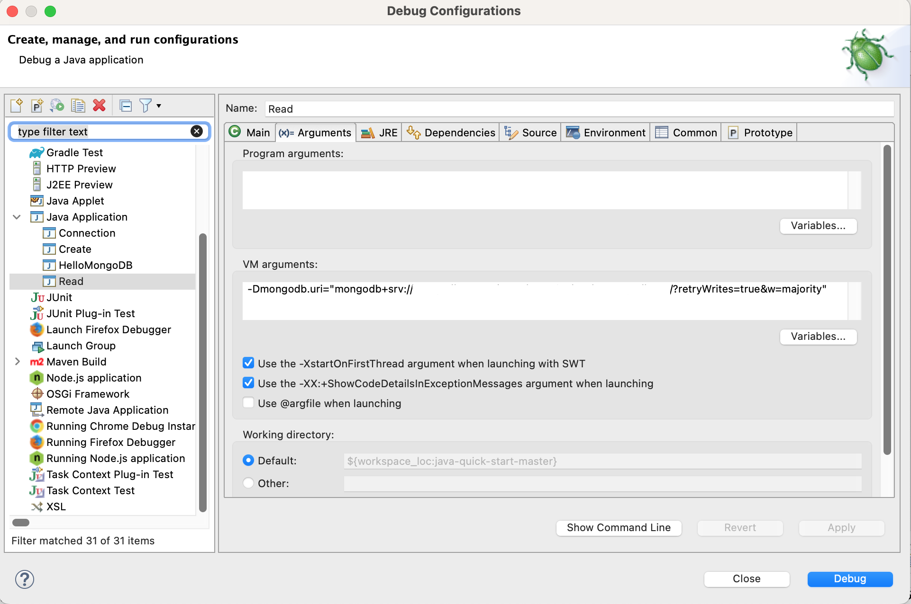

# [Getting Started with MongoDB and Java - CRUD Operations Tutorial](https://www.mongodb.com/developer/languages/java/java-setup-crud-operations/)

# 1. Running connection test

## From command line

```bash
mvn compile exec:java -Dexec.mainClass="com.mongodb.quickstart.Connection" \
	-Dmongodb.uri="???"


=> Print result of the '{ping: 1}' command.
{
  "ok": 1
}
=> Connection successful: true
=> Print list of databases:
{"name": "MongoBank", "sizeOnDisk": 81920, "empty": false}
{"name": "mongodbVSCodePlaygroundDB", "sizeOnDisk": 40960, "empty": false}
{"name": "myApp", "sizeOnDisk": 143360, "empty": false}
{"name": "sample_airbnb", "sizeOnDisk": 55328768, "empty": false}
{"name": "sample_analytics", "sizeOnDisk": 10063872, "empty": false}
{"name": "sample_geospatial", "sizeOnDisk": 1339392, "empty": false}
{"name": "sample_guides", "sizeOnDisk": 40960, "empty": false}
{"name": "sample_mflix", "sizeOnDisk": 49532928, "empty": false}
{"name": "sample_restaurants", "sizeOnDisk": 8892416, "empty": false}
{"name": "sample_supplies", "sizeOnDisk": 1097728, "empty": false}
{"name": "sample_training", "sizeOnDisk": 56762368, "empty": false}
{"name": "sample_weatherdata", "sizeOnDisk": 2752512, "empty": false}
{"name": "users", "sizeOnDisk": 65953792, "empty": false}
{"name": "admin", "sizeOnDisk": 385024, "empty": false}
{"name": "local", "sizeOnDisk": 10377297920, "empty": false}
```

## From eclipse IDE

In **debug configurations -> Arguments -> VM Arguments** enter following:

`-Dmongodb.uri="???"`

 

# Finders

```bash
# sample_training database
use sample_training;

# grades collection 
db.grades.findOne({student_id: 0, class_id: 339})
```

# Create (see Create.java)

```bash
db.grades.findOne({student_id: 10000, class_id: 1})
null
```


- `Create.java` will create following form of JSON

```json
{
  _id: ObjectId("657d1d68d2a73a6349a86694"),
  student_id: 10000,
  class_id: 1,
  scores: [
    {
      type: 'exam',
      score: 2.070124800930573
    },
    {
      type: 'quiz',
      score: 56.21367370682935
    },
    {
      type: 'homework',
      score: 86.50238764985313
    },
    {
      type: 'homework',
      score: 60.28307658348353
    }
  ]
}
```

# Read (see Read.java)


- From Compass:

`db.grades.findOne({"student_id":10000})`


```json

{
  _id: ObjectId("657d1d68d2a73a6349a86694"),
  student_id: 10000,
  class_id: 1,
  scores: [
    {
      type: 'exam',
      score: 2.070124800930573
    },
    {
      type: 'quiz',
      score: 56.21367370682935
    },
    {
      type: 'homework',
      score: 86.50238764985313
    },
    {
      type: 'homework',
      score: 60.28307658348353
    }
  ]
}
```

- When Read.java is executed

```bash
# find one document with new Document
Student 1: {"_id": {"$oid": "657d1d68d2a73a6349a86694"}, "student_id": 10000.0, "class_id": 1.0, "scores": [{"type": "exam", "score": 2.070124800930573}, {"type": "quiz", "score": 56.21367370682935}, {"type": "homework", "score": 86.50238764985313}, {"type": "homework", "score": 60.28307658348353}]}

# find one document with Filters.eq()
Student 2: {"_id": {"$oid": "657d1d68d2a73a6349a86694"}, "student_id": 10000.0, "class_id": 1.0, "scores": [{"type": "exam", "score": 2.070124800930573}, {"type": "quiz", "score": 56.21367370682935}, {"type": "homework", "score": 86.50238764985313}, {"type": "homework", "score": 60.28307658348353}]}

# find a list of documents and iterate throw it using an iterator.
Student list with a cursor: 
{"_id": {"$oid": "657d1d68d2a73a6349a86694"}, "student_id": 10000.0, "class_id": 1.0, "scores": [{"type": "exam", "score": 2.070124800930573}, {"type": "quiz", "score": 56.21367370682935}, {"type": "homework", "score": 86.50238764985313}, {"type": "homework", "score": 60.28307658348353}]}
{"_id": {"$oid": "657d1d69d2a73a6349a86695"}, "student_id": 10001.0, "class_id": 1.0, "scores": [{"type": "exam", "score": 62.82493340600278}, {"type": "quiz", "score": 96.78936202142256}, {"type": "homework", "score": 43.41390600978452}, {"type": "homework", "score": 34.160601231327846}]}
{"_id": {"$oid": "657d1d69d2a73a6349a86696"}, "student_id": 10001.0, "class_id": 2.0, "scores": [{"type": "exam", "score": 30.069304404355933}, {"type": "quiz", "score": 17.079183808576236}, {"type": "homework", "score": 60.16711996319103}, {"type": "homework", "score": 64.0464162460929}]}
{"_id": {"$oid": "657d1d69d2a73a6349a86697"}, "student_id": 10001.0, "class_id": 3.0, "scores": [{"type": "exam", "score": 41.88575214251059}, {"type": "quiz", "score": 32.30839431149576}, {"type": "homework", "score": 66.63139786123438}, {"type": "homework", "score": 52.41675483133853}]}
{"_id": {"$oid": "657d1d69d2a73a6349a86698"}, "student_id": 10001.0, "class_id": 4.0, "scores": [{"type": "exam", "score": 7.762203668584666}, {"type": "quiz", "score": 33.3737876980269}, {"type": "homework", "score": 86.0339901168386}, {"type": "homework", "score": 15.141885210985173}]}
{"_id": {"$oid": "657d1d69d2a73a6349a86699"}, "student_id": 10001.0, "class_id": 5.0, "scores": [{"type": "exam", "score": 70.36518730612627}, {"type": "quiz", "score": 31.19243991640569}, {"type": "homework", "score": 93.11160531030669}, {"type": "homework", "score": 74.20182266866588}]}
{"_id": {"$oid": "657d1d69d2a73a6349a8669a"}, "student_id": 10001.0, "class_id": 6.0, "scores": [{"type": "exam", "score": 61.68189474157572}, {"type": "quiz", "score": 94.00708830973524}, {"type": "homework", "score": 1.7031593706234416}, {"type": "homework", "score": 11.109243117004796}]}
{"_id": {"$oid": "657d1d69d2a73a6349a8669b"}, "student_id": 10001.0, "class_id": 7.0, "scores": [{"type": "exam", "score": 43.81731482250204}, {"type": "quiz", "score": 90.51741731458216}, {"type": "homework", "score": 78.36877126568808}, {"type": "homework", "score": 80.28578473672594}]}
{"_id": {"$oid": "657d1d69d2a73a6349a8669c"}, "student_id": 10001.0, "class_id": 8.0, "scores": [{"type": "exam", "score": 25.611632113095695}, {"type": "quiz", "score": 93.99165881808229}, {"type": "homework", "score": 68.56150803536212}, {"type": "homework", "score": 75.48564722367597}]}
{"_id": {"$oid": "657d1d69d2a73a6349a8669d"}, "student_id": 10001.0, "class_id": 9.0, "scores": [{"type": "exam", "score": 50.246943107527045}, {"type": "quiz", "score": 72.92309173761869}, {"type": "homework", "score": 64.94473377612312}, {"type": "homework", "score": 14.332969421010732}]}
{"_id": {"$oid": "657d1d69d2a73a6349a8669e"}, "student_id": 10001.0, "class_id": 10.0, "scores": [{"type": "exam", "score": 56.1412764769593}, {"type": "quiz", "score": 92.33116659190969}, {"type": "homework", "score": 43.639434224211115}, {"type": "homework", "score": 56.137207459030634}]}

# find a list of documents and use a List object instead of an iterator
Student list with an ArrayList:
{"_id": {"$oid": "657d1d68d2a73a6349a86694"}, "student_id": 10000.0, "class_id": 1.0, "scores": [{"type": "exam", "score": 2.070124800930573}, {"type": "quiz", "score": 56.21367370682935}, {"type": "homework", "score": 86.50238764985313}, {"type": "homework", "score": 60.28307658348353}]}
{"_id": {"$oid": "657d1d69d2a73a6349a86695"}, "student_id": 10001.0, "class_id": 1.0, "scores": [{"type": "exam", "score": 62.82493340600278}, {"type": "quiz", "score": 96.78936202142256}, {"type": "homework", "score": 43.41390600978452}, {"type": "homework", "score": 34.160601231327846}]}
{"_id": {"$oid": "657d1d69d2a73a6349a86696"}, "student_id": 10001.0, "class_id": 2.0, "scores": [{"type": "exam", "score": 30.069304404355933}, {"type": "quiz", "score": 17.079183808576236}, {"type": "homework", "score": 60.16711996319103}, {"type": "homework", "score": 64.0464162460929}]}
{"_id": {"$oid": "657d1d69d2a73a6349a86697"}, "student_id": 10001.0, "class_id": 3.0, "scores": [{"type": "exam", "score": 41.88575214251059}, {"type": "quiz", "score": 32.30839431149576}, {"type": "homework", "score": 66.63139786123438}, {"type": "homework", "score": 52.41675483133853}]}
{"_id": {"$oid": "657d1d69d2a73a6349a86698"}, "student_id": 10001.0, "class_id": 4.0, "scores": [{"type": "exam", "score": 7.762203668584666}, {"type": "quiz", "score": 33.3737876980269}, {"type": "homework", "score": 86.0339901168386}, {"type": "homework", "score": 15.141885210985173}]}
{"_id": {"$oid": "657d1d69d2a73a6349a86699"}, "student_id": 10001.0, "class_id": 5.0, "scores": [{"type": "exam", "score": 70.36518730612627}, {"type": "quiz", "score": 31.19243991640569}, {"type": "homework", "score": 93.11160531030669}, {"type": "homework", "score": 74.20182266866588}]}
{"_id": {"$oid": "657d1d69d2a73a6349a8669a"}, "student_id": 10001.0, "class_id": 6.0, "scores": [{"type": "exam", "score": 61.68189474157572}, {"type": "quiz", "score": 94.00708830973524}, {"type": "homework", "score": 1.7031593706234416}, {"type": "homework", "score": 11.109243117004796}]}
{"_id": {"$oid": "657d1d69d2a73a6349a8669b"}, "student_id": 10001.0, "class_id": 7.0, "scores": [{"type": "exam", "score": 43.81731482250204}, {"type": "quiz", "score": 90.51741731458216}, {"type": "homework", "score": 78.36877126568808}, {"type": "homework", "score": 80.28578473672594}]}
{"_id": {"$oid": "657d1d69d2a73a6349a8669c"}, "student_id": 10001.0, "class_id": 8.0, "scores": [{"type": "exam", "score": 25.611632113095695}, {"type": "quiz", "score": 93.99165881808229}, {"type": "homework", "score": 68.56150803536212}, {"type": "homework", "score": 75.48564722367597}]}
{"_id": {"$oid": "657d1d69d2a73a6349a8669d"}, "student_id": 10001.0, "class_id": 9.0, "scores": [{"type": "exam", "score": 50.246943107527045}, {"type": "quiz", "score": 72.92309173761869}, {"type": "homework", "score": 64.94473377612312}, {"type": "homework", "score": 14.332969421010732}]}
{"_id": {"$oid": "657d1d69d2a73a6349a8669e"}, "student_id": 10001.0, "class_id": 10.0, "scores": [{"type": "exam", "score": 56.1412764769593}, {"type": "quiz", "score": 92.33116659190969}, {"type": "homework", "score": 43.639434224211115}, {"type": "homework", "score": 56.137207459030634}]}

# find a list of documents and print using a consumer
Student list using a Consumer:
{"_id": {"$oid": "657d1d68d2a73a6349a86694"}, "student_id": 10000.0, "class_id": 1.0, "scores": [{"type": "exam", "score": 2.070124800930573}, {"type": "quiz", "score": 56.21367370682935}, {"type": "homework", "score": 86.50238764985313}, {"type": "homework", "score": 60.28307658348353}]}
{"_id": {"$oid": "657d1d69d2a73a6349a86695"}, "student_id": 10001.0, "class_id": 1.0, "scores": [{"type": "exam", "score": 62.82493340600278}, {"type": "quiz", "score": 96.78936202142256}, {"type": "homework", "score": 43.41390600978452}, {"type": "homework", "score": 34.160601231327846}]}
{"_id": {"$oid": "657d1d69d2a73a6349a86696"}, "student_id": 10001.0, "class_id": 2.0, "scores": [{"type": "exam", "score": 30.069304404355933}, {"type": "quiz", "score": 17.079183808576236}, {"type": "homework", "score": 60.16711996319103}, {"type": "homework", "score": 64.0464162460929}]}
{"_id": {"$oid": "657d1d69d2a73a6349a86697"}, "student_id": 10001.0, "class_id": 3.0, "scores": [{"type": "exam", "score": 41.88575214251059}, {"type": "quiz", "score": 32.30839431149576}, {"type": "homework", "score": 66.63139786123438}, {"type": "homework", "score": 52.41675483133853}]}
{"_id": {"$oid": "657d1d69d2a73a6349a86698"}, "student_id": 10001.0, "class_id": 4.0, "scores": [{"type": "exam", "score": 7.762203668584666}, {"type": "quiz", "score": 33.3737876980269}, {"type": "homework", "score": 86.0339901168386}, {"type": "homework", "score": 15.141885210985173}]}
{"_id": {"$oid": "657d1d69d2a73a6349a86699"}, "student_id": 10001.0, "class_id": 5.0, "scores": [{"type": "exam", "score": 70.36518730612627}, {"type": "quiz", "score": 31.19243991640569}, {"type": "homework", "score": 93.11160531030669}, {"type": "homework", "score": 74.20182266866588}]}
{"_id": {"$oid": "657d1d69d2a73a6349a8669a"}, "student_id": 10001.0, "class_id": 6.0, "scores": [{"type": "exam", "score": 61.68189474157572}, {"type": "quiz", "score": 94.00708830973524}, {"type": "homework", "score": 1.7031593706234416}, {"type": "homework", "score": 11.109243117004796}]}
{"_id": {"$oid": "657d1d69d2a73a6349a8669b"}, "student_id": 10001.0, "class_id": 7.0, "scores": [{"type": "exam", "score": 43.81731482250204}, {"type": "quiz", "score": 90.51741731458216}, {"type": "homework", "score": 78.36877126568808}, {"type": "homework", "score": 80.28578473672594}]}
{"_id": {"$oid": "657d1d69d2a73a6349a8669c"}, "student_id": 10001.0, "class_id": 8.0, "scores": [{"type": "exam", "score": 25.611632113095695}, {"type": "quiz", "score": 93.99165881808229}, {"type": "homework", "score": 68.56150803536212}, {"type": "homework", "score": 75.48564722367597}]}
{"_id": {"$oid": "657d1d69d2a73a6349a8669d"}, "student_id": 10001.0, "class_id": 9.0, "scores": [{"type": "exam", "score": 50.246943107527045}, {"type": "quiz", "score": 72.92309173761869}, {"type": "homework", "score": 64.94473377612312}, {"type": "homework", "score": 14.332969421010732}]}
{"_id": {"$oid": "657d1d69d2a73a6349a8669e"}, "student_id": 10001.0, "class_id": 10.0, "scores": [{"type": "exam", "score": 56.1412764769593}, {"type": "quiz", "score": 92.33116659190969}, {"type": "homework", "score": 43.639434224211115}, {"type": "homework", "score": 56.137207459030634}]}

# find a list of documents with sort, skip, limit and projection
Student sorted, skipped, limited and projected:
{"student_id": 10001.0, "class_id": 3.0}
{"student_id": 10001.0, "class_id": 2.0}
```

- Use Helpers when possible

```java

// without helpers
gradesCollection.find(new Document("student_id", new Document("$gte", 10000)));

// with the Filters.gte() helper
gradesCollection.find(gte("student_id", 10000));
```

- Iterators

```java
FindIterable<Document> iterable = gradesCollection.find(gte("student_id", 10000));
MongoCursor<Document> cursor = iterable.iterator();
System.out.println("Student list with cursor: ");
while (cursor.hasNext()) {
    System.out.println(cursor.next().toJson());
}
```

- List

```java
List<Document> studentList = gradesCollection.find(gte("student_id", 10000)).into(new ArrayList<>());
System.out.println("Student list with an ArrayList:");
for (Document student : studentList) {
    System.out.println(student.toJson());
}
```

- Consumer Interface

```java
Consumer<Document> printConsumer = document -> System.out.println(document.toJson());
gradesCollection.find(gte("student_id", 10000)).forEach(printConsumer);
```

- Cursors, sort, skip, limit, and projections

projection: is used to transform
sorting: documents are returned in the natural order by default, so need to sort

```java
	List<Document> docs = gradesCollection.find(and(eq("student_id", 10001), lte("class_id", 5)))
	                                                  .projection(fields(excludeId(),
	                                                                     include("class_id",
	                                                                             "student_id")))
	                                                  .sort(descending("class_id"))
	                                                  .skip(2)
	                                                  .limit(2)
	                                                  .into(new ArrayList<>());
	
	System.out.println("Student sorted, skipped, limited and projected: ");
	for (Document student : docs) {
	    System.out.println(student.toJson());
	}
```

# Indexes


If you want to make these queries (with or without sort) efficient, you need  indexes!


- Before applying index

```bash
db.grades.find({ student_id: { $eq: 10001 }, class_id: { $lte: 5 } }).explain("executionStats")

{
  explainVersion: '1',
  queryPlanner: {
    namespace: 'sample_training.grades',
    indexFilterSet: false,
    parsedQuery: {
      '$and': [
        {
          student_id: {
            '$eq': 10001
          }
        },
        {
          class_id: {
            '$lte': 5
          }
        }
      ]
    },
    queryHash: 'FB341777',
    planCacheKey: 'FB341777',
    maxIndexedOrSolutionsReached: false,
    maxIndexedAndSolutionsReached: false,
    maxScansToExplodeReached: false,
    winningPlan: {
      stage: 'COLLSCAN',
      filter: {
        '$and': [
          {
            student_id: {
              '$eq': 10001
            }
          },
          {
            class_id: {
              '$lte': 5
            }
          }
        ]
      },
      direction: 'forward'
    },
    rejectedPlans: []
  },
  executionStats: {
    executionSuccess: true,
    nReturned: 5,
    executionTimeMillis: 97,
    totalKeysExamined: 0,
    totalDocsExamined: 100011,
    executionStages: {
      stage: 'COLLSCAN',
      filter: {
        '$and': [
          {
            student_id: {
              '$eq': 10001
            }
          },
          {
            class_id: {
              '$lte': 5
            }
          }
        ]
      },
      nReturned: 5,
      executionTimeMillisEstimate: 69,
      works: 100012,
      advanced: 5,
      needTime: 100006,
      needYield: 0,
      saveState: 100,
      restoreState: 100,
      isEOF: 1,
      direction: 'forward',
      docsExamined: 100011
    }
  },
  command: {
    find: 'grades',
    filter: {
      student_id: {
        '$eq': 10001
      },
      class_id: {
        '$lte': 5
      }
    },
    '$db': 'sample_training'
  },
  serverInfo: {
    host: 'ac-caoj4jo-shard-00-01.rdvculu.mongodb.net',
    port: 27017,
    version: '6.0.12',
    gitVersion: '21e6e8e11a45dfbdb7ca6cf95fa8c5f859e2b118'
  },
  serverParameters: {
    internalQueryFacetBufferSizeBytes: 104857600,
    internalQueryFacetMaxOutputDocSizeBytes: 104857600,
    internalLookupStageIntermediateDocumentMaxSizeBytes: 16793600,
    internalDocumentSourceGroupMaxMemoryBytes: 104857600,
    internalQueryMaxBlockingSortMemoryUsageBytes: 33554432,
    internalQueryProhibitBlockingMergeOnMongoS: 0,
    internalQueryMaxAddToSetBytes: 104857600,
    internalDocumentSourceSetWindowFieldsMaxMemoryBytes: 104857600
  },
  ok: 1,
  '$clusterTime': {
    clusterTime: Timestamp({ t: 1702737196, i: 2 }),
    signature: {
      hash: Binary(Buffer.from("9eee3e5fece5d6d6a47d356b1d20ed341d270854", "hex"), 0),
      keyId: 7262713354492314000
    }
  },
  operationTime: Timestamp({ t: 1702737196, i: 2 })
}
```

- Now apply the index

```bash
db.grades.createIndex({"student_id": 1, "class_id": -1})

'student_id_1_class_id_-1'
```

- Evaluate the plan again


```bash

db.grades.find({ student_id: { $eq: 10001 }, class_id: { $lte: 5 } }).explain("executionStats")


{
  explainVersion: '1',
  queryPlanner: {
    namespace: 'sample_training.grades',
    indexFilterSet: false,
    parsedQuery: {
      '$and': [
        {
          student_id: {
            '$eq': 10001
          }
        },
        {
          class_id: {
            '$lte': 5
          }
        }
      ]
    },
    queryHash: 'FB341777',
    planCacheKey: '5C55F1C8',
    maxIndexedOrSolutionsReached: false,
    maxIndexedAndSolutionsReached: false,
    maxScansToExplodeReached: false,
    winningPlan: {
      stage: 'FETCH',
      inputStage: {
        stage: 'IXSCAN',
        keyPattern: {
          student_id: 1,
          class_id: -1
        },
        indexName: 'student_id_1_class_id_-1',
        isMultiKey: false,
        multiKeyPaths: {
          student_id: [],
          class_id: []
        },
        isUnique: false,
        isSparse: false,
        isPartial: false,
        indexVersion: 2,
        direction: 'forward',
        indexBounds: {
          student_id: [
            '[10001, 10001]'
          ],
          class_id: [
            '[5, -inf.0]'
          ]
        }
      }
    },
    rejectedPlans: []
  },
  executionStats: {
    executionSuccess: true,
    nReturned: 5,
    executionTimeMillis: 1,
    totalKeysExamined: 5,
    totalDocsExamined: 5,
    executionStages: {
      stage: 'FETCH',
      nReturned: 5,
      executionTimeMillisEstimate: 0,
      works: 6,
      advanced: 5,
      needTime: 0,
      needYield: 0,
      saveState: 0,
      restoreState: 0,
      isEOF: 1,
      docsExamined: 5,
      alreadyHasObj: 0,
      inputStage: {
        stage: 'IXSCAN',
        nReturned: 5,
        executionTimeMillisEstimate: 0,
        works: 6,
        advanced: 5,
        needTime: 0,
        needYield: 0,
        saveState: 0,
        restoreState: 0,
        isEOF: 1,
        keyPattern: {
          student_id: 1,
          class_id: -1
        },
        indexName: 'student_id_1_class_id_-1',
        isMultiKey: false,
        multiKeyPaths: {
          student_id: [],
          class_id: []
        },
        isUnique: false,
        isSparse: false,
        isPartial: false,
        indexVersion: 2,
        direction: 'forward',
        indexBounds: {
          student_id: [
            '[10001, 10001]'
          ],
          class_id: [
            '[5, -inf.0]'
          ]
        },
        keysExamined: 5,
        seeks: 1,
        dupsTested: 0,
        dupsDropped: 0
      }
    }
  },
  command: {
    find: 'grades',
    filter: {
      student_id: {
        '$eq': 10001
      },
      class_id: {
        '$lte': 5
      }
    },
    '$db': 'sample_training'
  },
  serverInfo: {
    host: 'ac-caoj4jo-shard-00-01.rdvculu.mongodb.net',
    port: 27017,
    version: '6.0.12',
    gitVersion: '21e6e8e11a45dfbdb7ca6cf95fa8c5f859e2b118'
  },
  serverParameters: {
    internalQueryFacetBufferSizeBytes: 104857600,
    internalQueryFacetMaxOutputDocSizeBytes: 104857600,
    internalLookupStageIntermediateDocumentMaxSizeBytes: 16793600,
    internalDocumentSourceGroupMaxMemoryBytes: 104857600,
    internalQueryMaxBlockingSortMemoryUsageBytes: 33554432,
    internalQueryProhibitBlockingMergeOnMongoS: 0,
    internalQueryMaxAddToSetBytes: 104857600,
    internalDocumentSourceSetWindowFieldsMaxMemoryBytes: 104857600
  },
  ok: 1,
  '$clusterTime': {
    clusterTime: Timestamp({ t: 1702737312, i: 13 }),
    signature: {
      hash: Binary(Buffer.from("de8c4872048fad2a20b83e4f0fa56a2576929017", "hex"), 0),
      keyId: 7262713354492314000
    }
  },
  operationTime: Timestamp({ t: 1702737312, i: 13 })
}
```

**Note:** 

1. With this index, we can see that we have no SORT stage, so we are not doing a sort in memory 
as the documents are already sorted "for free" and returned in the order of the index.

2. We don't have any FETCH stage, so this is a covered query, the most efficient type of query 
you can run in MongoDB. Indeed, all the information we are returning at the end is already in 
the index, so the index itself contains everything we need to answer this query.


# Update (see Update.java)


```bash

=> Updating the doc with {"student_id":10000}. Adding comment.
{
  "_id": {
    "$oid": "657d1d68d2a73a6349a86694"
  },
  "student_id": 10000.0,
  "class_id": 1.0,
  "scores": [
    {
      "type": "exam",
      "score": 2.070124800930573
    },
    {
      "type": "quiz",
      "score": 56.21367370682935
    },
    {
      "type": "homework",
      "score": 86.50238764985313
    },
    {
      "type": "homework",
      "score": 60.28307658348353
    }
  ],
  "comment": "You should learn MongoDB!"
}
AcknowledgedUpdateResult{matchedCount=1, modifiedCount=1, upsertedId=null}

=> Upsert document with {"student_id":10002.0, "class_id": 10.0} because it doesn't exist yet.
AcknowledgedUpdateResult{matchedCount=0, modifiedCount=0, upsertedId=BsonObjectId{value=657dcd4f62973db7050f5112}}
{
  "_id": {
    "$oid": "657dcd4f62973db7050f5112"
  },
  "class_id": 10.0,
  "student_id": 10002.0,
  "comments": [
    "You will learn a lot if you read the MongoDB blog!"
  ]
}

=> Updating all the documents with {"student_id":10001}.
AcknowledgedUpdateResult{matchedCount=10, modifiedCount=10, upsertedId=null}

=> FindOneAndUpdate operation. Printing the old version by default:
{
  "_id": {
    "$oid": "657d1d68d2a73a6349a86694"
  },
  "student_id": 10000.0,
  "class_id": 1.0,
  "scores": [
    {
      "type": "exam",
      "score": 2.070124800930573
    },
    {
      "type": "quiz",
      "score": 56.21367370682935
    },
    {
      "type": "homework",
      "score": 86.50238764985313
    },
    {
      "type": "homework",
      "score": 60.28307658348353
    }
  ],
  "comment": "You should learn MongoDB!"
}

=> FindOneAndUpdate operation. But we can also ask for the new version of the doc:
{
  "_id": {
    "$oid": "657d1d69d2a73a6349a8669e"
  },
  "student_id": 10001.0,
  "scores": [
    {
      "type": "exam",
      "score": 112.2825529539186
    },
    {
      "type": "quiz",
      "score": 92.33116659190969
    },
    {
      "type": "homework",
      "score": 43.639434224211115
    },
    {
      "type": "homework",
      "score": 56.137207459030634
    }
  ],
  "comments": [
    "You will learn a lot if you read the MongoDB blog!",
    "This comment is uniq"
  ],
  "new_class_id": 10.0,
  "x": 10
}
```

- [UNTESTED] To get both the NEW and OLD versions do the following:


```java

import com.mongodb.MongoClient;
import com.mongodb.MongoClientURI;
import com.mongodb.client.MongoCollection;
import com.mongodb.client.MongoDatabase;
import org.bson.Document;

public class FindOneAndUpdateExample {

    public static void main(String[] args) {
        // Connection URI
        String connectionString = "mongodb://localhost:27017";

        // Database and collection names
        String dbName = "yourDatabase";
        String collectionName = "yourCollection";

        // Create MongoClient
        try (MongoClient mongoClient = new MongoClient(new MongoClientURI(connectionString))) {
            // Get database
            MongoDatabase database = mongoClient.getDatabase(dbName);

            // Get collection
            MongoCollection<Document> collection = database.getCollection(collectionName);

            // Specify the filter and update operations
            Document filter = new Document(/* your filter criteria */);
            Document update = new Document("$set", new Document("previousState", collection.find(filter).first()));

            // Perform findOneAndUpdate to get both old and new versions
            Document result = collection.findOneAndUpdate(filter, update);

            // Print old and new versions
            System.out.println("Old Document: " + result.get("previousState"));
            System.out.println("New Document: " + result);
        }
    }
}

```

# Delete (see Delete.java)

```bash

AcknowledgedDeleteResult{deletedCount=1}
{
  "_id": {
    "$oid": "657dcd4f62973db7050f5112"
  },
  "class_id": 10.0,
  "student_id": 10002.0,
  "comments": [
    "You will learn a lot if you read the MongoDB blog!"
  ]
}
AcknowledgedDeleteResult{deletedCount=10}

```
